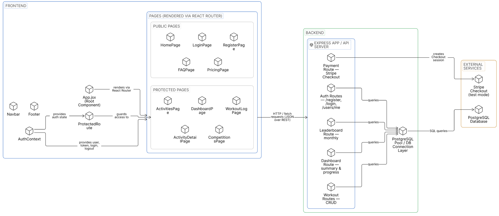
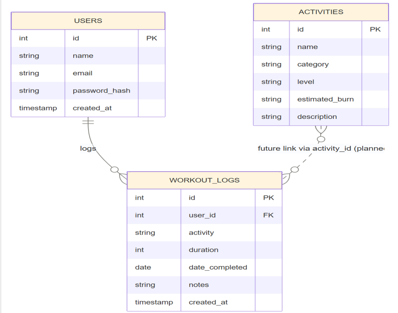
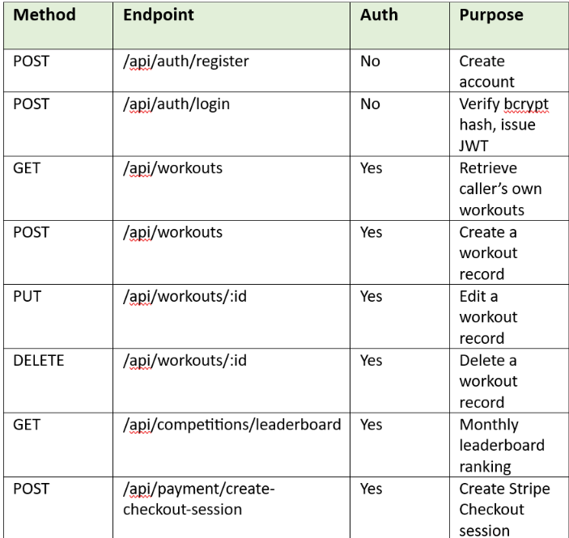

---

# FitTrack

> A full-stack fitness tracking application. Log workouts, monitor your history, and visualise progress through a personal dashboard secured with JWT authentication and backed by PostgreSQL.

---

## Table of Contents

- [TL;DR](#tldr)
- [Overview](#overview)
- [Architecture](#architecture)
- [Tech Stack](#tech-stack)
- [Project Structure](#project-structure)
- [Database Schema](#database-schema)
- [Getting Started](#getting-started)
  - [Prerequisites](#prerequisites)
  - [Database Setup](#database-setup)
  - [API Setup](#api-setup)
  - [Client Setup](#client-setup)
- [Environment Variables](#environment-variables)
- [API Reference](#api-reference)
- [Running Tests](#running-tests)
- [CI/CD Pipeline](#cicd-pipeline)
- [Quality & Security](#quality--security)
- [Legacy Code](#legacy-code)
- [License](#license)

---

## TL;DR

FitTrack is a full-stack fitness logger. Users register, log workout sessions with activity type, date, duration and notes, and view a personal dashboard summarising their stats. All data is scoped to the authenticated user via JWT.

| Layer | Technology | Purpose |
|---|---|---|
| API | Node.js + Express 5 | REST backend, auth, data |
| Auth | bcrypt + JWT | Secure login, 7-day tokens |
| Database | PostgreSQL | Persistent workout storage |
| Frontend | React 19 + Vite | SPA client, routing |
| Tests | Jest + Supertest | API integration test suite |
| CI | GitHub Actions | Runs tests on every push & PR |

---

## Overview

FitTrack is split into two independently runnable services:

- **`fittrack-api`** — an Express REST API that handles registration, login, and all workout CRUD. Passwords are hashed with bcrypt; sessions are stateless JWT tokens (7-day expiry). The API validates all inputs and returns structured JSON errors.
- **`fittrack-client`** — a React SPA built with Vite, using React Router for client-side navigation. It consumes the API at `http://localhost:5000`.

A legacy codebase (`fittrack-legacy`) is preserved in the repository for reference.

---


## Architecture

FitTrack is built as a full-stack web application using a React/Vite frontend, an Express/Node.js backend API and a PostgreSQL database. The frontend communicates with the backend through HTTP/JSON requests, while JWT authentication protects user-specific routes such as dashboard data and workout logs. A Stripe Checkout test-mode route is also included as a prototype external service integration.




---

## Tech Stack

| Area | Main Technologies |
|---|---|
| Frontend | React 19, Vite, React Router |
| Backend | Node.js 20, Express 5 |
| Database | PostgreSQL |
| Authentication | bcrypt, JWT |
| Testing | Jest, Supertest |
| CI/CD | GitHub Actions |

---

## Project Structure

```
fittrack-project/
├── .github/
│   └── workflows/
│       └── ci.yml              # GitHub Actions — runs on every push & PR
│
├── fittrack-api/               # Express REST API
│   ├── app.js                  # App config, all routes, auth middleware
│   ├── server.js               # HTTP server entry point
│   ├── jest.config.js          # Jest configuration
│   ├── tests/
│   │   ├── setup.js            # Jest global test setup
│   │   ├── health.test.js      # Health endpoint tests
│   │   ├── auth.test.js        # Register & login tests
│   │   └── workouts.test.js    # Workout CRUD & auth guard tests
│   └── package.json
│
├── fittrack-client/            # React + Vite SPA
│   ├── src/
│   │   ├── components/         # Navbar, ProtectedRoute, WeatherWidget, ...
│   │   ├── pages/              # Login, Register, Dashboard, WorkoutLog, ...
│   │   ├── context/           # AuthContext (login state)
│   │   ├── layouts/           # Page layout(s)
│   │   └── utils/             # API helper
│   ├── public/
│   ├── index.html
│   └── package.json
│
├── fittrack-legacy/            # Legacy codebase (reference only, not active)
│
├── fittrack-api-reference.png  # API reference diagram
├── fittrack-architecture.png   # Architecture diagram
├── fittrack-database-schema.png # Database schema diagram
└── README.md
```

---

## Database Schema

Three tables. All workout data is user-scoped via `user_id` foreign key.



Run this to create the schema:

```sql
CREATE TABLE users (
  id              SERIAL PRIMARY KEY,
  name            TEXT NOT NULL,
  email           TEXT UNIQUE NOT NULL,
  password_hash   TEXT NOT NULL
);

CREATE TABLE activities (
  id        SERIAL PRIMARY KEY,
  name      TEXT NOT NULL,
  category  TEXT
);

CREATE TABLE workout_logs (
  id              SERIAL PRIMARY KEY,
  user_id         INTEGER REFERENCES users(id) ON DELETE CASCADE,
  activity        TEXT NOT NULL,
  date_completed  DATE NOT NULL,
  duration        INTEGER,
  notes           TEXT
);
```

---

## Getting Started

### Prerequisites

- **Node.js** v20+
- **npm** v9+
- **PostgreSQL** running locally (or a connection string to a hosted instance)

### Database Setup

Connect to your PostgreSQL instance and run the SQL above to create the three tables, then note your credentials for the `.env` file below.

### API Setup

```bash
cd fittrack-api
npm install
```

Create `fittrack-api/.env` — see [Environment Variables](#environment-variables).

```bash
npm start        # → http://localhost:5000
```

### Client Setup

```bash
cd fittrack-client
npm install
npm run dev      # → http://localhost:5173
```

The client expects the API at `http://localhost:5000`. Both services must be running for the app to function.

---

## Environment Variables

Create `fittrack-api/.env`:

```env
# PostgreSQL connection
DB_USER=your_pg_username
DB_HOST=localhost
DB_NAME=fittrack
DB_PASSWORD=your_pg_password
DB_PORT=5432

# API port (optional — defaults to 5000)
PORT=5000

# JWT signing secret — use a long random string in production
JWT_SECRET=replace_this_with_a_strong_secret

# Stripe Checkout test mode
STRIPE_SECRET_KEY=sk_test_replace_with_your_own_key
CLIENT_URL=http://localhost:5173
```

> `.env` is excluded from version control via `.gitignore`. Never commit credentials.

---

## API Reference

Base URL: `http://localhost:5000`

Protected routes require: `Authorization: Bearer <token>`





### Error Responses

All errors follow this shape:

```json
{ "message": "A human-readable error description" }
```

| Status | Meaning |
|---|---|
| 400 | Validation error — missing or invalid field |
| 401 | No token, invalid token, or wrong credentials |
| 404 | Resource not found (or not owned by this user) |
| 409 | Conflict — email already registered |
| 500 | Unexpected server error |

---

## Running Tests

Tests use **Jest** and **Supertest** to make HTTP assertions directly against the Express app — no live server or real database required (the database is mocked).

```bash
cd fittrack-api
npm test
```

Test coverage:

| File | What it tests |
|---|---|
| `tests/health.test.js` | `GET /api/health` smoke test |
| `tests/auth.test.js` | Register (valid, invalid, duplicate), Login (valid, wrong password, missing fields) |
| `tests/workouts.test.js` | GET/POST/DELETE workouts, auth guard enforcement, input validation |

---

## CI/CD Pipeline

A GitHub Actions workflow runs the API test suite automatically on every push and pull request. The workflow installs the backend dependencies inside `fittrack-api` and runs the Jest/Supertest tests.

A green workflow check means the API tests have passed.

---

## Quality & Security

**Lighthouse audit** (production build, home page):

| Metric | Score |
|---|---|
| Performance | 89 |
| Accessibility | 86 |
| Best Practices | 100 |
| SEO | 100 |

**Security:** passwords are hashed with bcrypt (salted, 10 rounds); sessions use signed JWTs verified on every protected route; and all database access uses parameterised queries to prevent SQL injection. A full security appraisal (OWASP Top 10 / STRIDE) is maintained alongside the project. Known hardening items recorded as future work include rate limiting on authentication routes, a Content-Security-Policy, and HSTS.

---

## Legacy Code

The `fittrack-legacy/` directory contains an earlier version of the codebase. It is preserved for reference and comparison but is **not actively maintained or run**. All development happens in `fittrack-api/` and `fittrack-client/`.

---

## License

ISC
